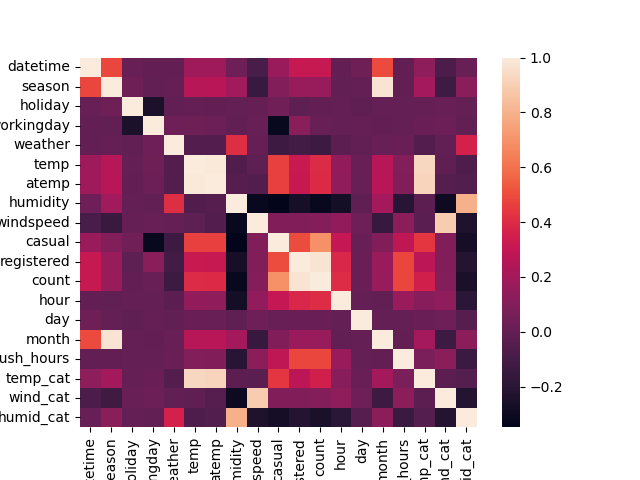
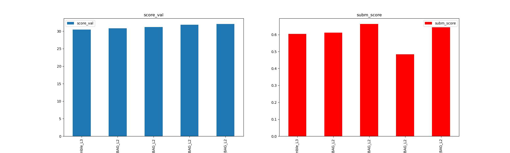
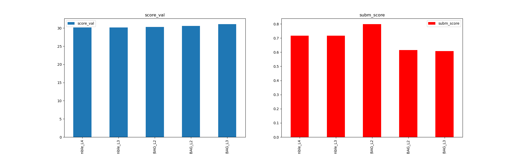
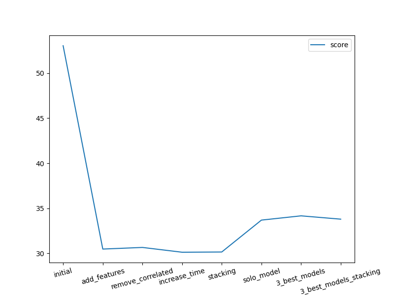
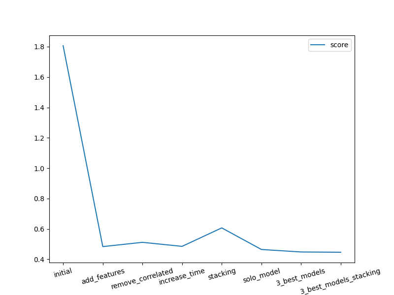
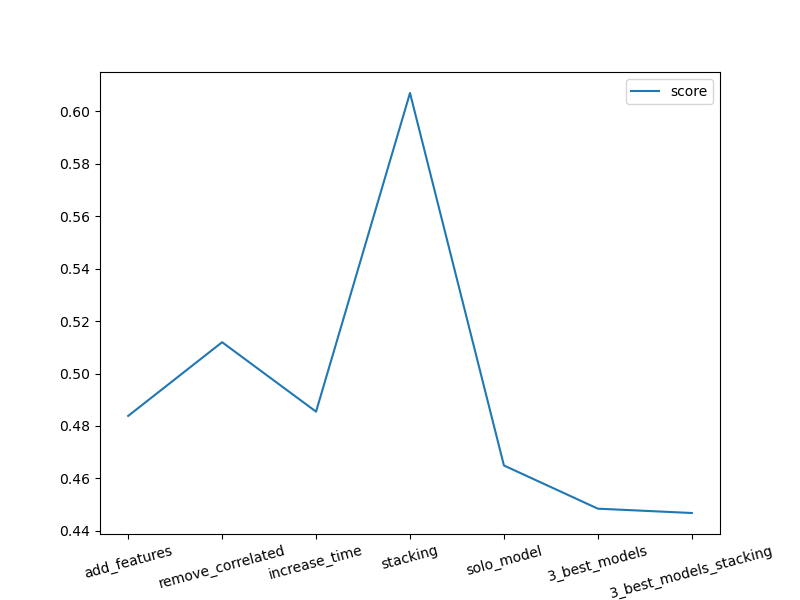

# Predicting Bike Sharing Demand with AutoGluon

This project demonstrates how to build, train, and optimize machine learning models using the AutoGluon library to predict hourly bike rental demand. It leverages the dataset from the **Kaggle Bike Sharing Demand competition**, focusing on using **AutoGluon's Tabular Prediction** capabilities. The process involves data loading, exploratory data analysis, feature engineering, iterative model training with various configurations, evaluation using the competition's metric (Root Mean Squared Error), and submission to the Kaggle leaderboard.

Predicting demand is a critical task in various industries, including transportation and delivery services (like bike sharing, ride-sharing, and food delivery). Accurate demand forecasts enable better resource management, operational efficiency, and ultimately enhance the customer experience by minimizing delays and ensuring service availability.

This project serves as a practical example of applying an AutoML library like AutoGluon to a real-world regression problem, showcasing techniques for improving model performance and documenting the process and results. Several submissions are made to the Kaggle competition to track the impact of different modeling strategies and achieve a competitive ranking.

## Table of Contents

- [Project Description](#project-description)
- [Dataset](#dataset)
- [Setup and Installation](#setup-and-installation)
- [How to Run](#how-to-run)
- [Analysis and Modeling Steps](#analysis-and-modeling-steps)
    - [Data Loading and Initial Exploration](#data-loading-and-initial-exploration)
    - [Exploratory Data Analysis and Feature Engineering](#exploratory-data-analysis-and-feature-engineering)
    - [Baseline Model Training](#baseline-model-training)
    - [Iterative Model Improvement](#iterative-model-improvement)
    - [Model Evaluation and Comparison](#model-evaluation-and-comparison)
- [Detailed Modeling Experiments and Findings](#detailed-modeling-experiments-and-findings)
- [Visualizations](#visualizations)
- [Future Improvements](#future-improvements)
- [License](#license)

## Project Description

The core task is to predict the `count` of total bike rentals (casual + registered) per hour based on temporal and environmental features. AutoGluon's `TabularPredictor` is employed to automate the machine learning pipeline, including data preprocessing, model selection, hyperparameter tuning, and ensembling.

The project follows an iterative process to enhance prediction accuracy:
1.  Establish a performance baseline using AutoGluon with default settings.
2.  Deepen understanding of the data through EDA and create new informative features.
3.  Retrain models with the enriched dataset.
4.  Experiment with AutoGluon's configuration parameters (e.g., training time, stacking, specific model hyperparameter tuning) to optimize performance.
5.  Evaluate model performance using validation RMSE and public Kaggle leaderboard scores.
6.  Submit predictions to the competition to benchmark against other participants.
7.  Document the outcomes of different modeling approaches.

## Dataset

The dataset for this project is provided by the [Kaggle Bike Sharing Demand competition](https://www.kaggle.com/c/bike-sharing-demand). It consists of historical hourly rental data for two years (2011-2012) in the `train.csv` file, along with corresponding weather and seasonal information. The `test.csv` file contains similar data for a future period, for which the `count` needs to be predicted. A `sampleSubmission.csv` provides the required format for submissions. The target variable is `count`, while `casual` and `registered` are components of `count` available only in the training data.

## Setup and Installation

To run this project, ensure you have Python installed. The necessary libraries can be installed via pip. The notebook includes the following installation commands:

```bash
pip install kaggle
pip install ipywidgets
pip install autogluon --no-cache-dir
```
The `--no-cache-dir` flag can be helpful in environments with limited cache space.

To download the dataset and submit predictions programmatically via the `kaggle` command-line interface, you need a Kaggle account and API key setup:

1.  Log in to your Kaggle account and go to your account settings (`https://www.kaggle.com/settings`).
2.  In the 'API' section, click "Create New API Token". This will download `kaggle.json`.
3.  Move `kaggle.json` to the `.kaggle` directory in your home folder:
    *   Linux/macOS: `~/.kaggle/kaggle.json`
    *   Windows: `C:\Users\<Your Username>\.kaggle\kaggle.json`
    *   Ensure the `.kaggle` directory exists and `kaggle.json` has appropriate permissions (e.g., read-only for your user).

## How to Run

1.  Ensure all setup steps are completed, including Kaggle API authentication.
2.  Open the project notebook (`Predict_Bike_Sharing_Demand_with_AutoGluon.ipynb`) in a suitable Python environment (Jupyter Notebook, JupyterLab, Google Colab, command line, etc.).
3.  Execute the code cells sequentially.

The script will automate the following steps:
*   Download and extract the dataset using the `kaggle` CLI.
*   Load data into pandas DataFrames.
*   Perform feature engineering and initial data analysis.
*   Train multiple AutoGluon models with varying configurations.
*   Generate predictions on the test set.
*   Create and submit prediction files to the Kaggle competition.
*   Print and plot model leaderboards and track Kaggle scores.
*   Save generated plots to the `img/` directory.

*Note: The script includes `time.sleep()` calls before querying Kaggle submissions to allow for processing time.*

## Analysis and Modeling Steps

This project follows a structured approach to build and refine the prediction model.

### Data Loading and Initial Exploration

The dataset is downloaded using the Kaggle API and loaded into pandas DataFrames (`train`, `test`, `sampleSubmission`). Initial exploration is performed using `.head()`, `.describe()`, and `.info()` to understand the structure, basic statistics, and data types.

### Exploratory Data Analysis and Feature Engineering

Visual EDA is conducted through histograms of all features (`train.hist()`) and correlation heatmaps (`seaborn.heatmap()`) to understand data distributions and relationships. Based on these insights and domain knowledge, several new features are engineered:

*   Extraction of `hour`, `day`, and `month` from the `datetime` column.
*   Creation of custom categorical features:
    *   `rush_hours`: Categorizes hours into morning, lunch, and evening rush periods.
    *   `temp_cat`: Categorizes temperature into cold, mild, and hot ranges.
    *   `wind_cat`: Categorizes windspeed into different levels.
    *   `humid_cat`: Categorizes humidity into different levels.
The datatypes of `season`, `weather`, and the newly created categorical features are explicitly converted to pandas 'category' dtype using `.astype('category')` to ensure proper handling by AutoGluon.

### Baseline Model Training

An initial AutoGluon `TabularPredictor` is trained on the raw data (excluding `casual` and `registered`) using the `best_quality` preset, optimizing for `root_mean_squared_error` (RMSE), and with a `time_limit` of 600 seconds. This establishes a baseline performance.

### Iterative Model Improvement

Multiple training runs are performed to explore different strategies for improving the model:

*   **Adding Engineered Features:** The model is retrained using the dataset enhanced with the features created during EDA.
*   **Feature Selection:** An experiment is conducted by removing some highly correlated features (`temp`, `atemp`, `windspeed`, `humidity`, `month`) to see if a simpler feature set impacts performance.
*   **Increased Training Time:** The `time_limit` for AutoGluon is increased (e.g., to 1200 seconds) to allow AutoGluon more time to train more models and find better parameters.
*   **Enabling Stacking:** AutoGluon's stacking capabilities are explicitly enabled (`num_bag_folds`, `num_bag_sets`, `num_stack_levels`) to build multi-layer ensembles.
*   **Training Solo Models:** Individual models (like `NN_TORCH`, `GBM`, `CAT`, `XGB`, `RF`, `XT`, `KNN`) are trained in isolation (`hyperparameters={'MODEL_NAME': {}}`) for a limited time to understand their individual performance characteristics on this dataset.
*   **Targeted Hyperparameter Tuning:** Hyperparameter tuning is performed on a selected subset of well-performing base models (`RF`, `CAT`, `XT`) using `hyperparameter_tune_kwargs`.
*   **Targeted HPO with Stacking:** The targeted HPO is combined with stacking for a more complex ensemble approach.

For each significant training run, predictions are generated on the test set, negative predictions are set to zero, and a submission file is created.

### Model Evaluation and Comparison

Model performance is evaluated using two key metrics:
*   **Validation RMSE:** Reported by AutoGluon in the `predictor.leaderboard()`. This metric is used internally by AutoGluon to select the best model and evaluate candidates.
*   **Kaggle Public Leaderboard Score:** The official RMSE score assigned by Kaggle after submitting predictions.

The performance of different modeling iterations is compared visually using line plots showing the trend of both validation RMSE and Kaggle score across the experimental runs. Leaderboard bar plots are also generated to compare the top models within specific AutoGluon training runs.

## Detailed Modeling Experiments and Findings

---

### Initial Training
#### What did you realize when you tried to submit your predictions? What changes were needed to the output of the predictor to submit your results?
Kaggle will reject the submission if we don't set everything to be > 0

#### What was the top-ranked model that performed?
The initial model that performed the best was WeightedEnsemble_L3.
Initial model performance:


### Exploratory data analysis and feature creation
#### What did the exploratory analysis find and how did you add additional features?
Feature correlation heatmap before feature creation:


After the EDA, we found out that the data is clean and there are no missing values. We can also create some new features to further improve models performance. 
I added:
- hour 
- day
- month
- rush_hours - hours when people are most likely to go out/go to lunch
- temp_cat - hot/mild/cold
- wind_cat - windy/not windy
- humid_cat - not humid/humid
Also, I changed the type of weather column to category.
Feature correlation heatmap after feature creation:


#### How much better did your model perform after adding additional features, and why do you think that is?
After the EDA and feature creation, the model performs much better.


I tried to remove highly correlated features to increase training, evaluation, and prediction speed. As expected, the models started to give worse results. We should decide what we need more from the model: training/prediction speed or accuracy.


### Hyperparameter tuning
#### How much better did your model perform after trying different hyperparameters?
I did several rounds of hyperparameter tuning to explore more possibilities. 
First of all, I tried to increase time_limit. From the documentation, we know that it will likely increase model performance. 


Then I changed hyper parameters related to model stacking and bagging. It is more resourse intensive but gives better performance.


Lastly, I trained several models one by one to determine which model performs best.


I chose 3 models to train against the  training set


Then I changed time_limit and stacking params, and trained the best 3 models to get the best result


### If you were given more time with this dataset, where do you think you would spend more time?
Explore more hyperparameters and give more time for training. Also, I can "play" with model hyperparameters like a number of epochs in NN and so on.

#### Create a table with the models you ran, the hyperparameters modified, and the Kaggle score.

|model|time_limit|presets|num_bag_folds|num_bag_sets|num_stack_levels|score|
|--|--|--|--|--|--|--|
|initial|600|best_quality|None|None|None|1.80625|
|add_features|600|best_quality|None|None|None|0.48384|
|hpo_time|1200|best_quality|None|None|None|0.48547|
|hpo_stacking|1200|best_quality|7|2|2|0.607|

#### Create a line plot showing the top model score for the three (or more) training runs during the project.




#### Create a line plot showing the top Kaggle score for the three (or more) prediction submissions during the project.






### Summary
From the bar plots of the models, we can see that the best-performing model on the training set was the ensemble model, but for the kaggle score, it is one of the following: RandomForest, ExtraTrees, or CAT. Also, from the line plot of training performance, we can see that after we start changing the hyperparameters of the models, training performance drops. This is because Autogluon automatically calculates the best hyperparameters for the models, and it is noted in the docs. The only hyperparameter that gave us better results was time_limit. 

From the line plot of Kaggle scores, we can see that models become better every step, except for the stacking model. For stacking and bagging, Autogluon needs more time and/or resources to train, so we have lower performance for the same time spent. 
For the last model in the kaggle submissions, I get score of 0.44681 by choosing the best 3 models and using them in an ensemble model. It is an incredible improvement in comparison with our initial model.

---

## Visualizations

The project generates several plots to support analysis and reporting:

*   Histograms showing the distribution of features (initial and after feature engineering).
*   Correlation heatmaps visualizing relationships between features.
*   Bar plots comparing validation and submission scores for top models from specific AutoGluon runs.
*   Line plots tracking the best model's validation RMSE across different experiments.
*   Line plots tracking the best (or selected) model's Kaggle public leaderboard score across different experiments.

These visualizations, saved in the `img/` directory, provide a clear picture of the data characteristics and the impact of different modeling choices on performance.

## Future Improvements

Potential avenues for further improving the model include:

*   **More Granular Time Features:** Explore features related to the day of the week, week of the year, or time since the start of the year/month.
*   **External Data Integration:** Incorporate official holiday data, special events, or more detailed weather forecasts.
*   **Target Transformation:** Experiment with predicting `log(count + 1)` or other transformations suitable for count data with a lower bound of zero and skewed distribution.
*   **Advanced AutoGluon Features:** Explore custom model presets, weighted ensembles, or specific model-specific hyperparameters not covered in the basic tuning.
*   **Error Analysis:** Analyze instances where the model makes large errors to identify potential missed features or patterns.
