# Report: Predict Bike Sharing Demand with AutoGluon Solution
#### Maksym Rimashevskyi

## Initial Training
### What did you realize when you tried to submit your predictions? What changes were needed to the output of the predictor to submit your results?
Kaggle will reject the submission if we don't set everything to be > 0

### What was the top ranked model that performed?
Initial model that performed the best was WeightedEnsemble_L3.
Initial model performance:
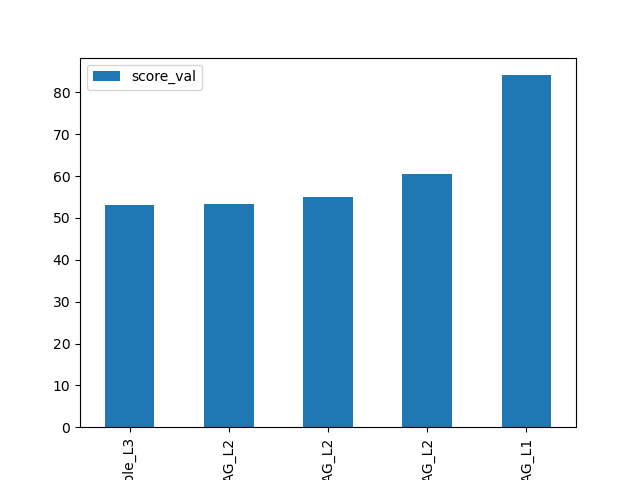

## Exploratory data analysis and feature creation
### What did the exploratory analysis find and how did you add additional features?
Feature correlation heatmap before feature creation:
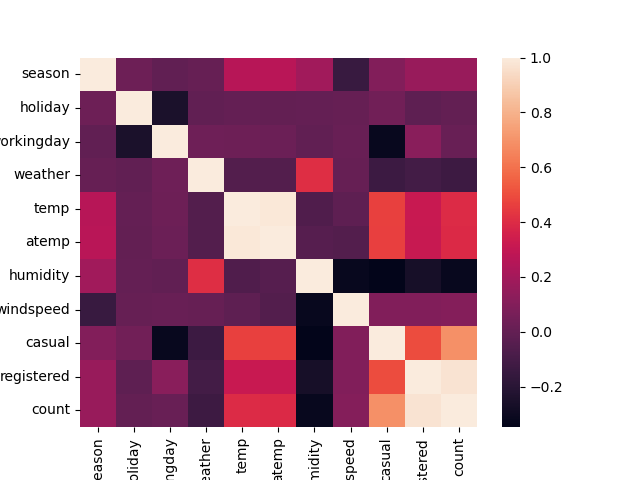

After the EDA we found out that data is clean and there are no missing values. We can also create some new features to further improve models performance. 
I added:
- hour 
- day
- month
- rush_hours - hours when people are most likely to go out/go lunch
- temp_cat - hot/mild/cold
- wind_cat - windy/not windy
- humid_cat - not humid/humid
Also I changed the type of weather column to category.
Feature correlation heatmap after feature creation:
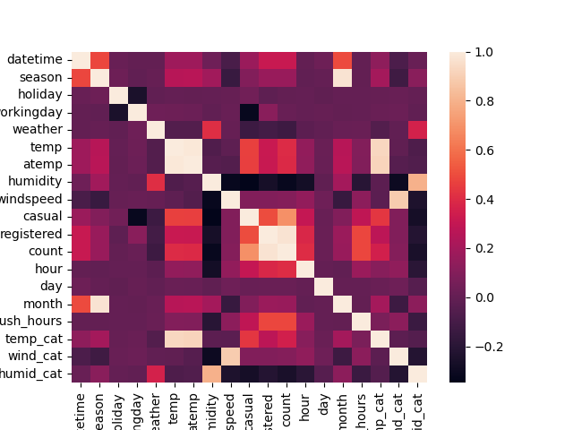

### How much better did your model preform after adding additional features and why do you think that is?
After the EDA and feature creation the model performs much better.
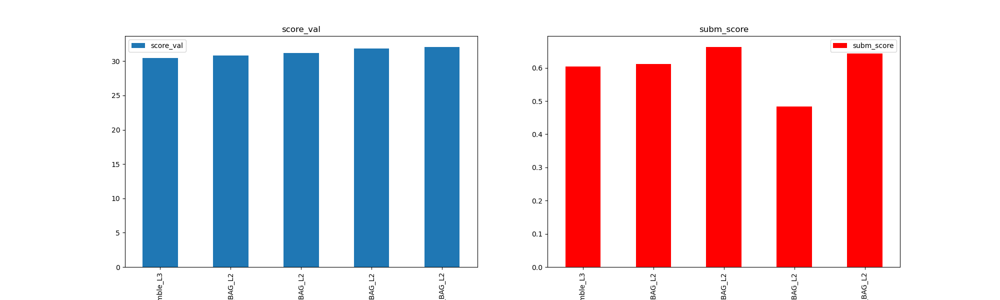

I tried to remove highly correlated features to increase training, evaluation and prediction speed. As expected the models started to give worse results. We should decide what we need more from the model: training/prediction speed or accuracy.
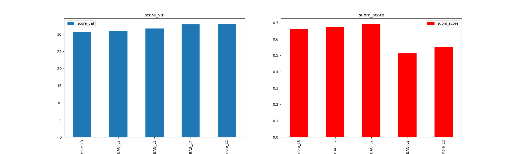

## Hyper parameter tuning
### How much better did your model preform after trying different hyper parameters?
I did several rounds of hyper parameters tuning to explore more possibilities. 
First of all I tried to increase time_limit. From docummentation we know that it will likely increase model performance. 
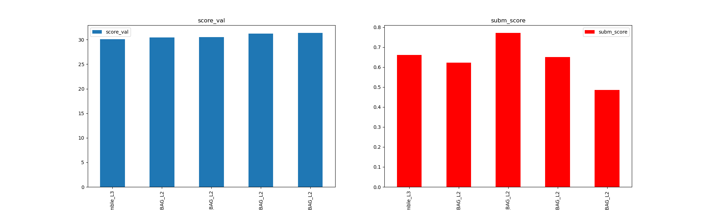

Then I changed hyper parameters related to model stacking and bagging. It is more resourse intensive but gives better performance.
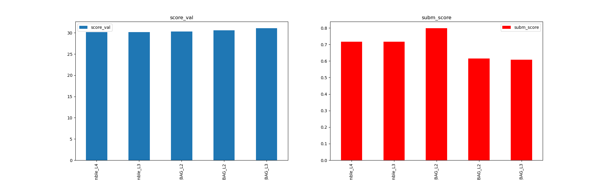

Lastly I trained several models one by one to determine what model performs best.
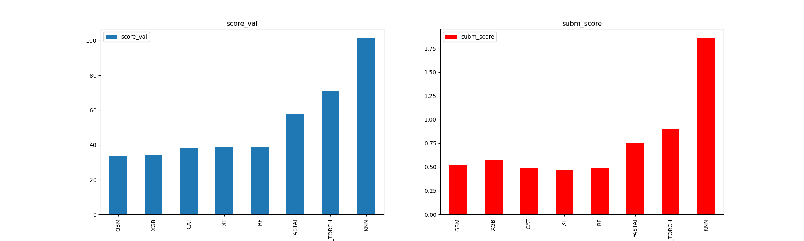

I chose 3 models to train against training set
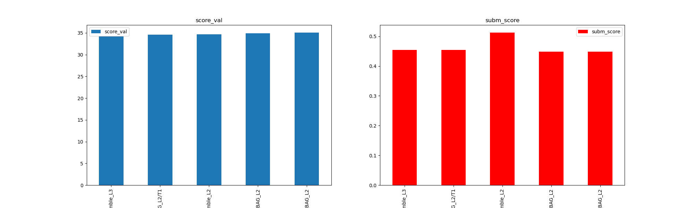

Then I changed time_limit and stacking params and trained best 3 models to get the best result
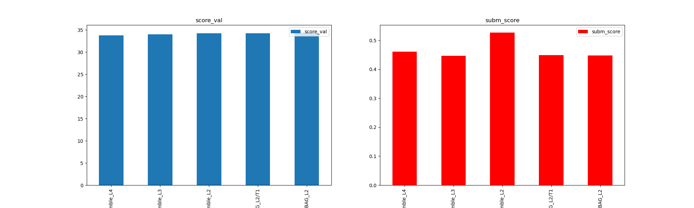

### If you were given more time with this dataset, where do you think you would spend more time?
Explore more hyper parameters and give more time for training. Also I can "play" with model hyperparameters like number of epochs in NN and so on.

### Create a table with the models you ran, the hyperparameters modified, and the kaggle score.

|model|time_limit|presets|num_bag_folds|num_bag_sets|num_stack_levels|score|
|--|--|--|--|--|--|--|
|initial|600|best_quality|None|None|None|1.80625|
|add_features|600|best_quality|None|None|None|0.48384|
|hpo_time|1200|best_quality|None|None|None|0.48547|
|hpo_stacking|1200|best_quality|7|2|2|0.607|

### Create a line plot showing the top model score for the three (or more) training runs during the project.

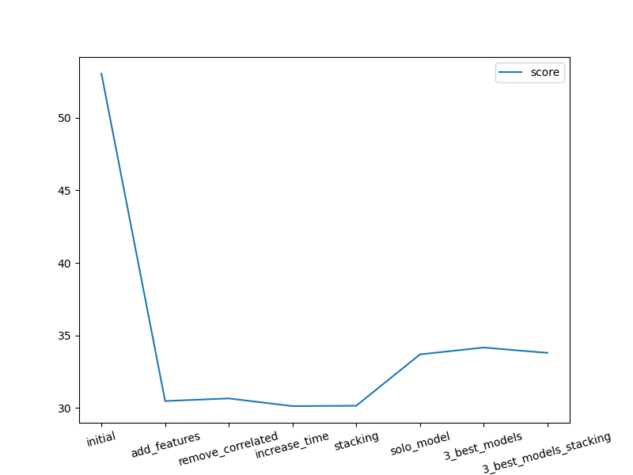

### Create a line plot showing the top kaggle score for the three (or more) prediction submissions during the project.

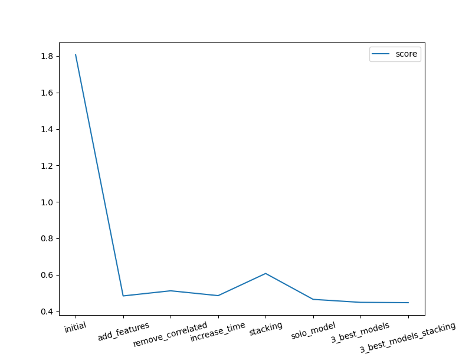

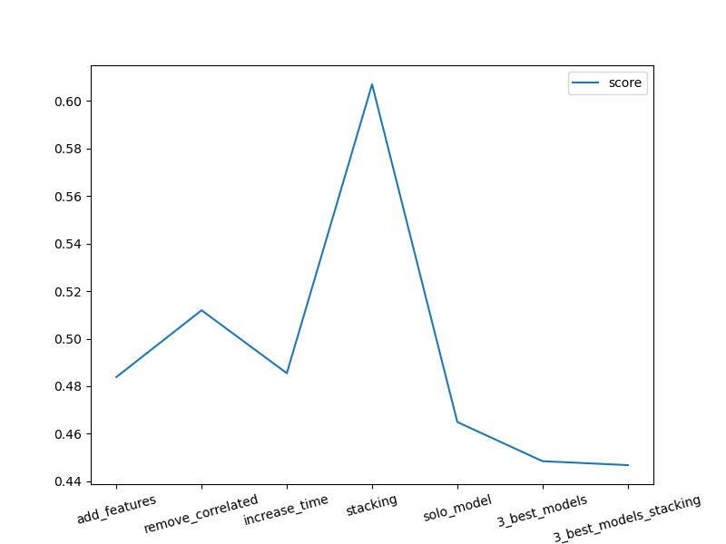

## Summary
From the bar plots of the models we can see, that the best performing model on training set was ensemble models but for kaggle score it is one of the following: RandomForest, ExtraTrees or CAT. Also from the line plot of training performance we can see that after we start changing hyper parameters of the models, training performance drops. This is because Autogluon automaticaly calculates best hyper params for the models and it is noted in the docs. The only hyper parameter that gave us better results was time_limit. 

From the line plot of kaggle scores we can see that models become better every step except for stacking model. For stacking and bagging Autogluon needs more time and/or resourses to train so we have lower performence for the same time spent. 
For the last model in kaggle submissions I get score of 0.44681 by choosing best 3 models and use them in ensemble model. It is incredible improvement in comparison with our initial model.